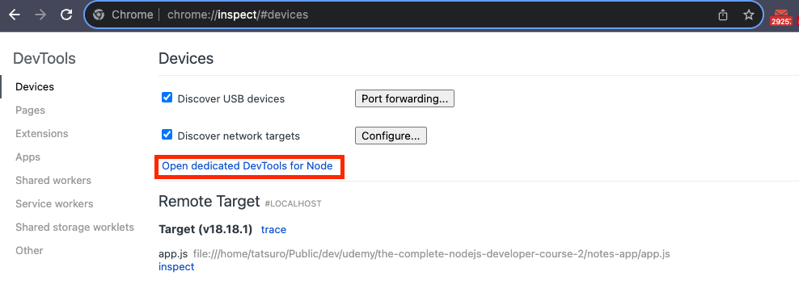

# chrome DevTools で debugging

1. inspect する file の箇所に debugger の line を埋め込む
   
1. debugger を起動

   - `node --inspect app.js add --title="Course" body="Node.js"`

1. chrome で`chrome://inspect`を開く
1. - local 環境での debug
     1. Remote Target で inspect をクリック、DevTools が立ち上がる
     1. Sources > Workspace > Add folder で project folder を追加
        
   - remote 環境での debug
     1.Open dedicated DevTools for Node で DevTools を立ち上げると、Sources > Node に debug している file が load される
     
     
1. 右の再生マークで debug 開始、`dubugger` の箇所で停止する
1. esc key で console が toggle するので console で処理結果を preview しながら debug
   
1. 終わったら再生ボタンで次に
1. 最後まで行ったら、terminal の>debug prompt に `restart` と打ち込むと再度チェックできる
1. terminal の debug を抜けるには `ctr + c` を 2 回
